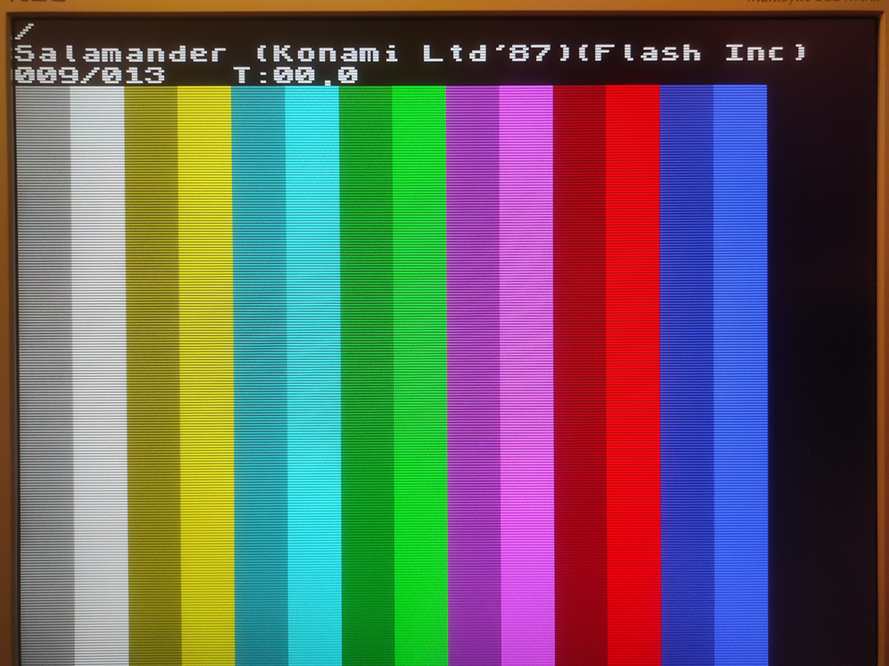
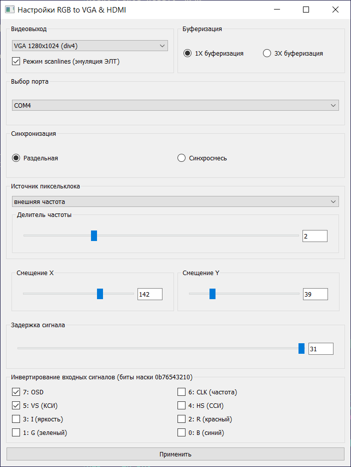
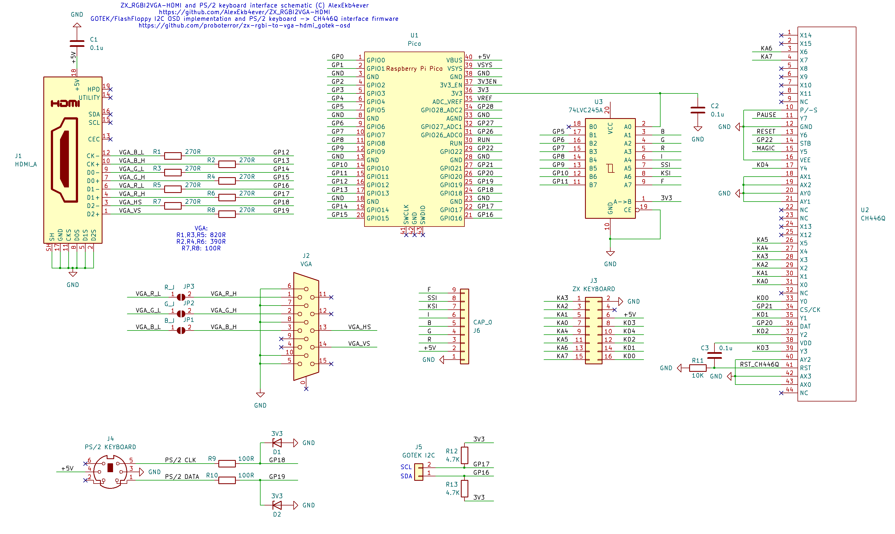

# zx-rgbi-to-vga-hdmi

For detailed hardware and original software information, please refer to the source: [ZX_RGBI2VGA-HDMI](https://github.com/AlexEkb4ever/ZX_RGBI2VGA-HDMI/).

## Changes and New Features

### Software

- **Video Output:**
  - Added new resolutions on VGA output (800x600, 1024x768, 1280x1024).
  - Introduced scanline effect at higher resolutions.
- **Configuration via Serial Terminal:**
  - Text-based menus.
  - Frequency presets for self-synchronizing capture mode (supports ZX Spectrum 48K/128K timings).
  - Real-time settings adjustments for capture delay, image position, scanline effects, and buffering modes.
- **PIO Clock Divider Optimization:** Enhanced precision in self-synchronizing capture mode.
- **Test/Welcome Screen:** Styled like the ZX Spectrum 128K.
- **GOTEK floppy drive emulator [I2C OSD](ZX_RGBI_TO_VGA_HDMI/gotek_i2c_osd.c):** [FlashFloppy](https://github.com/keirf/flashfloppy) firmware I2C 40x4 on-screen display, VGA and HDMI output supported.
- **PS/2 Keyboard:** PS/2 - ZX Spectrum 58-key extended keyboard interface with CH446Q analog switch array in serial mode.
- **GOTEK control:** Navigate FlashFloppy menu with PS/2 keyboard.

### Hardware

- **Analog to Digital Conversion:** Converts Analog RGB to digital RGBI.
  - Based on the [RGBtoHDMI](https://github.com/hoglet67/RGBtoHDMI) project.

### Removed Features

- Z80 CLK external clock source.

# GOTEK floppy drive emulator with flashfloppy firmware I2C LCD OSD interface.

Ветка с реализацией поддержки SetupGUI и доработками от Дмитрий Стародубцев (@cinsler78)

- Настройка параметров из GUI утилиты SetupGUI. Поддержаны специфичные настройки (SVGA разрешения, scanlines, отключение FF OSD).
- Сделан вывод на экран OSD на прозрачном фоне и в зависимости от цвета бордера смена цвета шрифта.
- Для Waveshare RP2040-Zero добавлена цветная светодиодная индикация (зеленый: OSD - включен, желтый: OSD - выключен).
- Добавлено автоопределение VGA/HDMI по кабелю. При любом изменение режима видео автоопределение отключается и используются настройки сохраненные в памяти.
- Кнопка на GP28 включает/выключает вывод OSD без сохранения. При длительном удержании кнопки на GP28 - сброс на настройки по умолчанию, включая автоопределение, с цветовой индикацией для Waveshare RP2040-Zero.

Автоопределение подключение VGA/HDMI основывается на том, что входы сигналов VGA RGB имеют сопротивление ~75 Ом. Последовательность проверки: для одного из GPIO выходов сигналов RGB включается pulldown, на выход подается импульс длительностью 1 мкс, в цикле замеряется, сколько времени занимает разряд сигнала на входе. Эмпирически установлено, что для VGA время разряда меньше 5 мкс, для HDMI от 9 до 12 мкс в зависимости от кабеля.
Процедура может работать ненадежно.

VGA and HDMI output supported.

Для сборки может понадобиться включить поддержку Waveshare RP2040-Zero и переопределить константы I2C_SLAVE_SDA_PIN / I2C_SLAVE_SCL_PIN.

_TL;DR: Connect GOTEK SDA and SCL pins to Pico GP16/GP17 pins (GP26/27 for RP2040-Zero). SDA and SCL lines should be pulled up to 3.3V with 4.7~10K resistors. Also support PS/2 keyboard for ZX Spectrum and OSD control._

VGA and HDMI OSD output implemented. 
OSD can be controlled with connected PS/2 keyboard.

Based on [flashfloppy-osd](https://github.com/keirf/flashfloppy-osd/) 1.9 by Keir Fraser 
Implementation: [github.com/proboterror](https://github.com/proboterror)

I2C communications to the host:
1. Emulate HD44780 LCD controller via a PCF8574 I2C backpack. Supported screen size 20x4 characters.
2. Support extended custom FF OSD protocol with bidirectional comms, up to 40x4 characters.

## Compile:

Use Visual Studio Code.

Install "Arduino Community Edition" extension. 
Check and correct paths to rp2040 packages / Arduino CLI executable in .vscode/c_cpp_properties.json and scripts/make.ps1.

Run "Terminal/Run Task.../Build"

Do not use Arduino IDE, it uses different SDK / libraries resulting in capture sync issues.

Add
'#define WAVESHARE_RP2040_ZERO'
in g_config.h when targeting WaveShare RP2040-Zero.

## RP Pico Configuration:
- Connect host computer to Raspberry Pi Pico USB. Do not forget to disconnect +5V line from ZX.
- Use SetupGUI utility.

## GOTEK/FlashFloppy OSD wiring:
I2C OSD uses 2 wires: SDA and SCL to connect RGBI2VGA adapter and GOTEK. Connect GOTEK SDA and SCL pins to Pico GP16/GP17 pins. SDA and SCL lines should be pulled up to VCC(3.3V) with 4.7~10K resistors on GOTEK or RGBI2VGA side.

OSD also can be used with any device supporting LCD PCF8574 16x2/20x4 protocol.

WaveShare RP2040-Zero board supported with keyboard interface disabled (GP26/GP27 for SDA/SCL).

## GOTEK/FlashFloppy configuration:
GOTEK configuration: 
[flashfloppy/wiki/Hardware-Mods#lcd-display](https://github.com/keirf/flashfloppy/wiki/Hardware-Mods#lcd-display) 
[flashfloppy/wiki/FF.CFG-Configuration-File](https://github.com/keirf/flashfloppy/wiki/FF.CFG-Configuration-File)

FF.CFG: 
for FF OSD protocol with dual OLED/LCD support: 
set:
`display-type=auto`
or
`display-type = oled-128x64`
with
`osd-display-order = 3,0`
`osd-columns = 40`
and
`display-off-secs = 0-255 (60 by default)`

display-order and osd-display-order can be set independently.

for single PCF8574 20x4 LCD display protocol: 
set:
`display-type=lcd-20x04`
with
`display-order=3,0,2,1`
and
`display-off-secs = 0-255 (60 by default)`

Russian filenames are supported, requires [flashfloppy-russian](https://github.com/proboterror/flashfloppy-russian) patched flashfloppy GOTEK firmware.

## PS/2 Keyboard support:
- Selected USB keyboards can be used with passive USB->PS/2 adapter: requires explicit support in keyboard's internal controller. Not tested.

## GOTEK/FlashFloppy OSD hotkeys:
- CTRL+RIGHT - right
- CTRL+LEFT - left
- CTRL+UP - directory up
- CTRL+DOWN - select item

## Special keys:
- F10 - PAUSE (Z80 BUSRQ/) (trigger)
- F11 - MAGIC (Z80 NMI/)
- F12 - RESET (Z80 RST/)

## Special keys wiring:
- Input: CH446Q pin 5: common/GND
- Output: CH446Q pin 15: MAGIC, pin 13: RESET, pin 11: PAUSE.

## Test features:
Selectable runtime HDMI palettes in [separate branch](https://github.com/proboterror/zx-rgbi-to-vga-hdmi_gotek-osd/tree/hdmi_rgb-palette) (setting save not implenented).