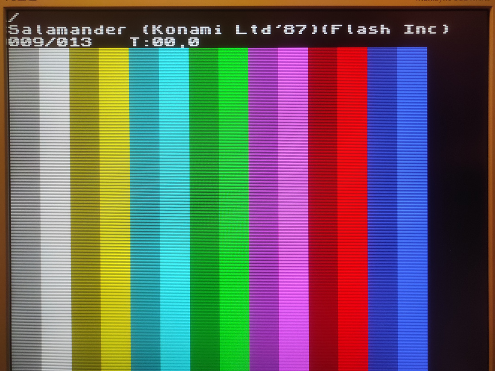
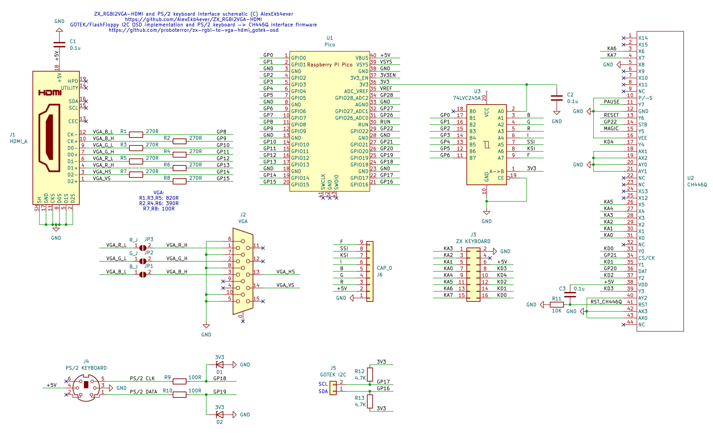

# zx-rgbi-to-vga-hdmi

A converter for ZX Spectrum RGBI video signals to modern VGA and HDMI displays.

For detailed hardware and original software information, see the upstream project:  
🔗 [ZX_RGBI2VGA-HDMI](https://github.com/AlexEkb4ever/ZX_RGBI2VGA-HDMI/)

---

## Alternative Firmware Build: Native Pico SDK

If you prefer working directly with the **Raspberry Pi Pico SDK** and **CMake**, check out the companion project:  
🔗 [zx-rgbi-to-vga-hdmi-PICOSDK](https://github.com/osemenyuk-114/zx-rgbi-to-vga-hdmi-PICOSDK)

This version of the firmware:

- Uses the **native Pico SDK** instead of the Arduino framework  
- Enables more direct control and customization of **PIO programs**  
- Ideal for developers experimenting with low-level video signal processing or custom capture logic

---

## Features

### Software

- **Video Output:**
  - VGA output with selectable resolutions: 640×480 @60Hz, 800×600 @60Hz, 1024×768 @60Hz, 1280×1024 @60Hz.
  - HDMI (DVI) resolutions: 640×480 @60Hz and 720×576 @50Hz.
  - Optional scanline effect on the VGA output at higher resolutions for a retro look.
  - "NO SIGNAL" message when no input is detected.
- **On-Screen Display (OSD) Menu:**
  - Full-featured graphical menu system overlaid on video output.
  - Three-button control (UP, DOWN, SEL) for easy navigation.
  - Real-time parameter adjustment with live preview.
  - Tuning mode for video settings without restarting output.
  - Quick VGA/DVI toggle via long SEL press (5 seconds).
  - All settings can be saved to flash memory.
  - Auto-timeout after 10 seconds of inactivity.
  - See [OSD Menu Guide](docs/OSD_MENU_GUIDE.md) for detailed usage instructions.
- **Configuration via Serial Terminal:**
  - Alternative text-based menu system for headless configuration.
  - Frequency presets for self-synchronizing capture mode (supports ZX Spectrum 48K/128K pixel clocks).
  - Real-time adjustment of all parameters (changes applied immediately).
  - Settings can be saved to flash memory without restart.
- **Test/Welcome Screen:** Styled after the ZX Spectrum 128K.
- **GOTEK floppy drive emulator [I2C OSD](ZX_RGBI_TO_VGA_HDMI/gotek_i2c_osd.c):** [FlashFloppy](https://github.com/keirf/flashfloppy) firmware I2C 40x4 on-screen display, VGA and HDMI output supported.
- **PS/2 Keyboard:** PS/2 - ZX Spectrum 58-key extended keyboard interface with CH446Q analog switch array in serial mode.
- **GOTEK control:** Navigate FlashFloppy menu with PS/2 keyboard.

### Hardware

- **Analog to Digital Conversion:** Converts analog RGB to digital RGBI.
  - Based on the project:  
🔗 [RGBtoHDMI](https://github.com/hoglet67/RGBtoHDMI)

---

## Removed Features

- Z80 CLK external clock source. Self-sync capture mode is now preferred.

---

## Recent Improvements

### Performance Improvements

- **Video Output Optimization**: Streamlined DMA handling for both VGA and DVI/HDMI output modes, resulting in more efficient memory usage and cleaner code structure.
- **Buffer Management**: Simplified buffer switching mechanisms for improved video processing performance.

### Development Experience

- **PlatformIO Integration**: Full PlatformIO support with Arduino framework for easier development and dependency management. The project can also be built using the Arduino IDE for those who prefer a simpler setup (requires: Optimization **-O3**, USB Stack - **Pico SDK**).
- **Enhanced Build System**: Improved VS Code integration with custom build scripts for streamlined development workflow.
- **Better Task Management**: Added comprehensive build, upload, and monitoring tasks with proper error handling.

### Code Quality

- **Memory Optimization**: Reduced unnecessary memory allocations and pointer complexity in video output modules.
- **Architecture Refinements**: Better separation of concerns between video input capture and output generation systems.
- **Maintainability**: Cleaner code structure while preserving critical hardware-specific requirements for reliable video processing.

# GOTEK floppy drive emulator with flashfloppy firmware I2C LCD OSD interface.

_TL;DR: Connect GOTEK SDA and SCL pins to Pico GP16/GP17 pins (GP26/27 for RP2040-Zero). SDA and SCL lines should be pulled up to 3.3V with 4.7~10K resistors. Also support PS/2 keyboard for ZX Spectrum and OSD control._

VGA and HDMI OSD output implemented. 
OSD can be controlled with connected PS/2 keyboard.

Based on [flashfloppy-osd](https://github.com/keirf/flashfloppy-osd/) 1.9 by Keir Fraser 
Implementation: [github.com/proboterror](https://github.com/proboterror)

I2C communications to the host:
1. Emulate HD44780 LCD controller via a PCF8574 I2C backpack. Supported screen size 20x4 characters.
2. Support extended custom FF OSD protocol with bidirectional comms, up to 40x4 characters.

## Compile:

Use Visual Studio Code.

Install "Arduino Community Edition" extension. 
Check and correct paths to rp2040 packages / Arduino CLI executable in .vscode/c_cpp_properties.json and scripts/make.ps1.

Run "Terminal/Run Task.../Build"

Do not use Arduino IDE, it uses different SDK / libraries resulting in capture sync issues.

Add
'#define WAVESHARE_RP2040_ZERO'
in g_config.h when targeting WaveShare RP2040-Zero.

## RP Pico Configuration:
- Connect host computer to Raspberry Pi Pico USB. Do not forget to disconnect +5V line from ZX.
- Use putty / minicom to connect to RP Pico COM port (9600 baud). 
- Press 'h' for menu help.

## GOTEK/FlashFloppy OSD wiring:
I2C OSD uses 2 wires: SDA and SCL to connect RGBI2VGA adapter and GOTEK. Connect GOTEK SDA and SCL pins to Pico GP16/GP17 pins. SDA and SCL lines should be pulled up to VCC(3.3V) with 4.7~10K resistors on GOTEK or RGBI2VGA side.

OSD also can be used with any device supporting LCD PCF8574 16x2/20x4 protocol.

WaveShare RP2040-Zero board supported with keyboard interface disabled (GP26/GP27 for SDA/SCL).

## GOTEK/FlashFloppy configuration:
GOTEK configuration: 
[flashfloppy/wiki/Hardware-Mods#lcd-display](https://github.com/keirf/flashfloppy/wiki/Hardware-Mods#lcd-display) 
[flashfloppy/wiki/FF.CFG-Configuration-File](https://github.com/keirf/flashfloppy/wiki/FF.CFG-Configuration-File)

FF.CFG: 
for FF OSD protocol with dual OLED/LCD support: 
set:
`display-type=auto`
or
`display-type = oled-128x64`
with
`osd-display-order = 3,0`
`osd-columns = 40`
and
`display-off-secs = 0-255 (60 by default)`

display-order and osd-display-order can be set independently.

for single PCF8574 20x4 LCD display protocol: 
set:
`display-type=lcd-20x04`
with
`display-order=3,0,2,1`
and
`display-off-secs = 0-255 (60 by default)`

Russian filenames are supported, requires [flashfloppy-russian](https://github.com/proboterror/flashfloppy-russian) patched flashfloppy GOTEK firmware.

## PS/2 Keyboard support:
- Selected USB keyboards can be used with passive USB->PS/2 adapter: requires explicit support in keyboard's internal controller. Not tested.

## GOTEK/FlashFloppy OSD hotkeys:
- CTRL+RIGHT - right
- CTRL+LEFT - left
- CTRL+UP - directory up
- CTRL+DOWN - select item

## Special keys:
- F10 - PAUSE (Z80 BUSRQ/) (trigger)
- F11 - MAGIC (Z80 NMI/)
- F12 - RESET (Z80 RST/)

## Special keys wiring:
- Input: CH446Q pin 5: common/GND
- Output: CH446Q pin 15: MAGIC, pin 13: RESET, pin 11: PAUSE.

## Test features:
Ветка с реализацией поддержки [SetupGUI](https://github.com/proboterror/zx-rgbi-to-vga-hdmi_gotek-osd/tree/SetupGUI) и доработками от Дмитрий Стародубцев (@cinsler78).

Selectable runtime HDMI palettes in [separate branch](https://github.com/proboterror/zx-rgbi-to-vga-hdmi_gotek-osd/tree/hdmi_rgb-palette) (setting save not implemented).